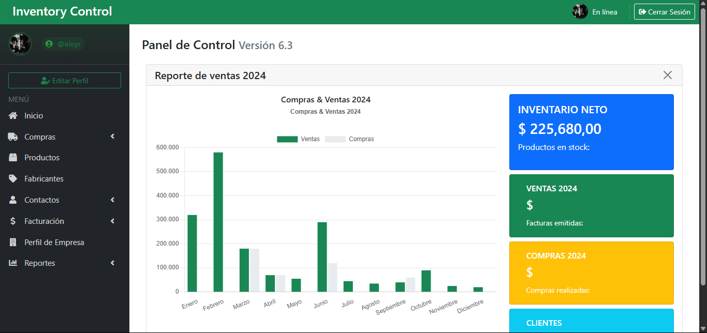
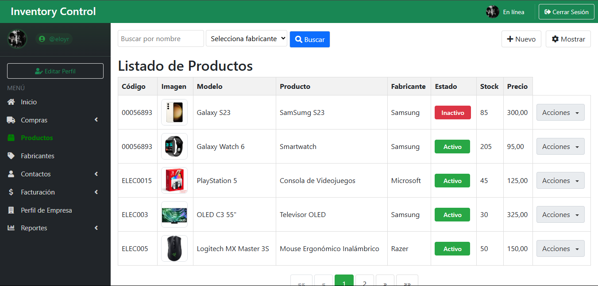
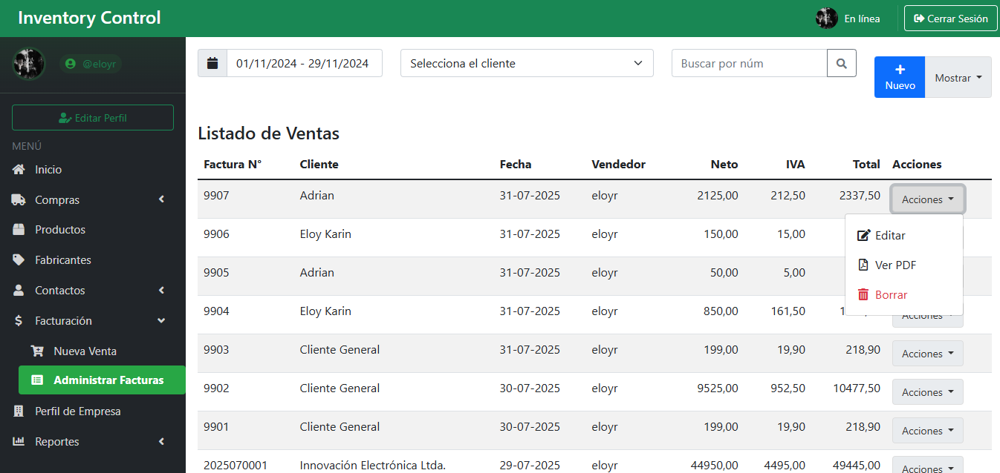

# Sistema de Inventario

Sistema web de gestión de inventario desarrollado con Django. Permite administrar productos, ventas, compras, clientes, proveedores y generar reportes.

## 🌐 Demo en Línea

Puedes ver una demostración en línea en: [https://sistema-inventario-xi.vercel.app](https://sistema-inventario-xi.vercel.app)

**Nota sobre la demo**: La demo online está limitada (no permite uploads de archivos). Para funcionalidad completa, ejecuta el proyecto localmente siguiendo las instrucciones de instalación.

## 📁 **Contenido de Este Repositorio**

### 💻 **Desarrollo Local Completo**:
- ✅ Código Django completo y funcional
- ✅ Setup automático con scripts incluidos
- ✅ Documentación detallada
- ✅ Sin archivos innecesarios de deployment

### 📁 **Solo Desarrollo Local**:
- `manage.py`, `requirements.txt`, `Inventario/`, `SistemaInventario/`
- `setup-local.bat` / `setup-local.sh` - Scripts de configuración automática
- `INSTALACION_RAPIDA.md` - Guía de 5 minutos

### 📚 **Documentación**:
- `README.md`, `DEPENDENCIAS.md` - Información del proyecto

## Capturas de Pantalla 📸

### Panel de Control

*Vista principal del panel de control con estadísticas y resumen de actividades.*

### Gestión de Productos

*Interfaz de gestión de productos con lista y detalles.*

### Nueva Venta

*Proceso de creación de una nueva venta con selección de productos.*

### Factura PDF

*Ejemplo de factura generada en formato PDF.*

### Reportes y Estadísticas

*Visualización de reportes y estadísticas del sistema.*

## Características 🚀

- Gestión de productos con imágenes y categorías
- Control de stock automático
- Generación de facturas en PDF
- Registro de ventas y compras
- Gestión de clientes y proveedores
- Panel de control con estadísticas
- Sistema de autenticación seguro
- Interfaz responsive con Bootstrap

## Requisitos Previos 📋

- Python 3.13 o superior
- pip (gestor de paquetes de Python)
- Navegador web moderno
- Git (para clonar el repositorio)

## Instalación Local 🔧

### 🚀 **Instalación Automática (Recomendada)**:

#### Windows:
```bash
git clone https://github.com/EloyKarinR/Sistema_Inventario.git
cd Sistema_Inventario
setup-local.bat
```

#### Linux/Mac:
```bash
git clone https://github.com/EloyKarinR/Sistema_Inventario.git
cd Sistema_Inventario
chmod +x setup-local.sh
./setup-local.sh
```

*Esta rama (`main`) contiene solo archivos para desarrollo local - sin archivos de deployment innecesarios.*

### 📝 **Método Manual**:

### 1. Clonar el repositorio:
```bash
git clone https://github.com/EloyKarinR/Sistema_Inventario.git
cd Sistema_Inventario
```

### 2. Crear y activar entorno virtual:
```bash
# Windows
python -m venv env
env\Scripts\activate

# Linux/Mac
python3 -m venv env
source env/bin/activate
```

### 3. Instalar dependencias:
```bash
pip install -r requirements.txt
```

**Dependencias incluidas**:
- Django 5.1.3 (framework web)
- Pillow 11.0.0 (manejo de imágenes)
- reportlab 4.2.5 (generación de PDFs)
- dj-database-url 2.1.0 (configuración de base de datos)
- Y otros 6 paquetes necesarios para el funcionamiento completo

### 4. Configurar base de datos:
```bash
python manage.py makemigrations
python manage.py migrate
```

### 5. Crear superusuario (administrador):
```bash
python manage.py createsuperuser
```
**Importante**: Crea tus propias credenciales únicas. Este será el administrador de TU instalación privada.

### 6. Crear carpetas para archivos multimedia:
```bash
mkdir media
mkdir media/productos
mkdir media/empresa
mkdir media/profile_pics
```

### 7. Recopilar archivos estáticos:
```bash
python manage.py collectstatic
```

### 8. Iniciar el servidor:
```bash
python manage.py runserver
```

### 9. Acceder al sistema:
- **Aplicación principal**: http://localhost:8000
- **Panel de administración**: http://localhost:8000/admin/

## Primera Configuración ⚙️

1. Acceder al panel de administración (`/admin/`) con las credenciales que creaste
2. Configurar el perfil de tu empresa en "Profiles"
3. Crear categorías de productos
4. Añadir productos iniciales con imágenes
5. Comenzar a usar el sistema con tus propios datos

## Diferencias: Demo Online vs. Instalación Local �

| Característica | Demo Online (Vercel) | Instalación Local |
|---|---|---|
| **Subida de imágenes** | ❌ No disponible | ✅ Completamente funcional |
| **Generación de PDFs** | ❌ Limitada | ✅ Completamente funcional |
| **Base de datos** | ✅ Solo lectura/demo | ✅ Completa con tus datos |
| **Personalización** | ❌ Datos de demo | ✅ 100% personalizable |
| **Rendimiento** | ⚡ Rápido (limitado) | ⚡ Óptimo (sin límites) |
| **Privacidad** | ⚠️ Demo pública | 🔒 Completamente privado |

**Recomendación**: Para uso real, siempre instala localmente.

## Solución de Problemas 🛠️

### Error: "No module named 'X'"
```bash
# Asegúrate de que el entorno virtual esté activado
env\Scripts\activate  # Windows
source env/bin/activate  # Linux/Mac

# Reinstala las dependencias
pip install -r requirements.txt
```

### Error: "No such table"
```bash
# Ejecuta las migraciones
python manage.py makemigrations
python manage.py migrate
```

### Error: Imágenes no se cargan
```bash
# Verifica que las carpetas media existan
mkdir media/productos
mkdir media/empresa
mkdir media/profile_pics
```

### Error: Archivos estáticos no se cargan
```bash
python manage.py collectstatic
```

## Uso del Sistema 💡

1. **Acceso inicial**: http://localhost:8000
2. **Iniciar sesión** con las credenciales que creaste
3. **Panel de control**: Estadísticas y resumen
4. **Gestión**: Productos, ventas, clientes, proveedores
5. **Reportes**: Facturas PDF y estadísticas

**Importante**: Cada instalación es completamente independiente y privada.

```
SistemaInventario/
├── Inventario/            # Aplicación principal
├── SistemaInventario/     # Configuración del proyecto
├── media/                 # Archivos subidos
├── static/                # Archivos estáticos
├── templates/             # Plantillas HTML
├── manage.py             # Script de gestión
└── requirements.txt      # Dependencias del proyecto
```

## Seguridad 🔐

### Autenticación y Privacidad
- **Instalación completamente independiente**: Cada persona/empresa tiene su propio sistema
- **Sin usuarios preconfigurados**: Cada instalación crea sus propias credenciales con `createsuperuser`
- **Base de datos local y privada**: Archivo `db.sqlite3` único para cada instalación
- **Sin conexión entre instalaciones**: Los datos no se comparten entre diferentes usuarios del sistema
- **Control total**: Cada empresa maneja sus propios usuarios, productos y datos

### Características de Seguridad
- Sistema de autenticación robusto de Django
- Protección contra CSRF
- Sesiones seguras con tiempo de expiración
- Validaciones en formularios y backend
- Sanitización de datos de entrada
- Variables de entorno para configuraciones sensibles
- Archivos críticos protegidos con .gitignore

## Contribuir 🤝

1. Hacer fork del proyecto
2. Crear rama para nueva característica
3. Hacer commit de los cambios
4. Hacer push a la rama
5. Crear Pull Request

## Autor ✒️

* **Eloy Karin** - *Desarrollo* - [EloyKarinR](https://github.com/EloyKarinR)

## Licencia 📄

Este proyecto está bajo la Licencia MIT - ver el archivo [LICENSE.md](LICENSE.md) para más detalles.

## Agradecimientos 🎁

* A la comunidad de Django
* A todos los que usan y mejoran este proyecto
 
