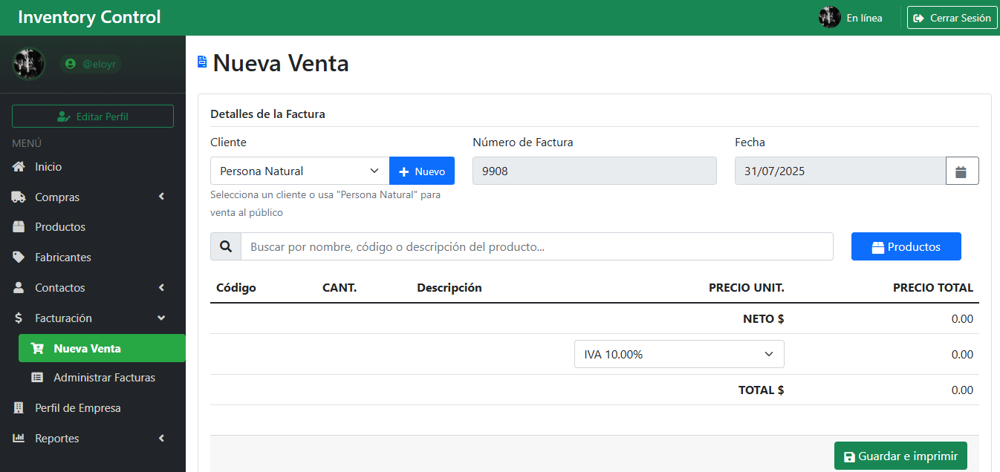

# Sistema de Inventario

Sistema web de gestión de inventario desarrollado con Django. Permite administrar productos, ventas, compras, clientes, proveedores y generar reportes.

## Capturas de Pantalla 📸 

### Panel de Control

*Vista principal del panel de control con estadísticas y resumen de actividades.*

### Gestión de Productos

*Interfaz de gestión de productos con lista y detalles.*

### Nueva Venta

*Proceso de creación de una nueva venta con selección de productos.*

### Factura PDF

*Ejemplo de factura generada en formato PDF.*

### Reportes y Estadísticas

*Visualización de reportes y estadísticas del sistema.*

## Características 🚀 

- Gestión de productos con imágenes y categorías
- Control de stock automático
- Generación de facturas en PDF
- Registro de ventas y compras
- Gestión de clientes y proveedores
- Panel de control con estadísticas
- Sistema de autenticación seguro
- Interfaz responsive con Bootstrap

## Requisitos Previos 📋 

- Python 3.13 o superior
- pip (gestor de paquetes de Python)
- Navegador web moderno
- Git (para clonar el repositorio)

## Instalación 🔧 

1. Clonar el repositorio:
```bash
git clone https://github.com/EloyKarinR/Sistema_Inventario.git
cd Sistema_Inventario
```

2. Crear y activar entorno virtual:
```bash
# Windows
python -m venv env
env\Scripts\activate

# Linux/Mac
python3 -m venv env
source env/bin/activate
```

3. Instalar dependencias:
```bash
pip install -r requirements.txt
```

4. Realizar migraciones:
```bash
python manage.py makemigrations
python manage.py migrate
```

5. Crear superusuario:
```bash
python manage.py createsuperuser
```

6. Crear carpetas necesarias:
```bash
mkdir media
mkdir media/productos
mkdir media/empresa
mkdir media/profile_pics
```

7. Iniciar el servidor:
```bash
python manage.py runserver
```

## Configuración ⚙️

1. Acceder al panel de administración (`/admin/`)
2. Crear perfil de empresa
3. Configurar categorías de productos
4. Añadir productos iniciales

## Uso 💡 

1. Acceder a `http://localhost:8000`
2. Iniciar sesión con las credenciales del superusuario
3. Navegar al panel de control
4. Comenzar a gestionar el inventario

## Estructura del Proyecto 📁 

```
SistemaInventario/
 ├── Inventario/            # Aplicación principal
 ├── SistemaInventario/     # Configuración del proyecto
 ├── media/                 # Archivos subidos
 ├── static/                # Archivos estáticos
 ├── templates/             # Plantillas HTML
 ├── manage.py             # Script de gestión
 └── requirements.txt      # Dependencias del proyecto
```

## Seguridad 🔐 

- Sistema de autenticación robusto
- Protección contra CSRF
- Sesiones seguras con tiempo de expiración
- Validaciones en formularios
- Sanitización de datos

## Contribuir 🤝 

1. Hacer fork del proyecto
2. Crear rama para nueva característica
3. Hacer commit de los cambios
4. Hacer push a la rama
5. Crear Pull Request

## Autor ✒️

* **Eloy Karin** - *Desarrollo* - [EloyKarinR](https://github.com/EloyKarinR)

## Licencia 📄 

Este proyecto está bajo la Licencia MIT - ver el archivo [LICENSE.md](LICENSE.md) para más detalles.

## Agradecimientos 🎁 

* A la comunidad de Django
* A todos los que usan y mejoran este proyecto
